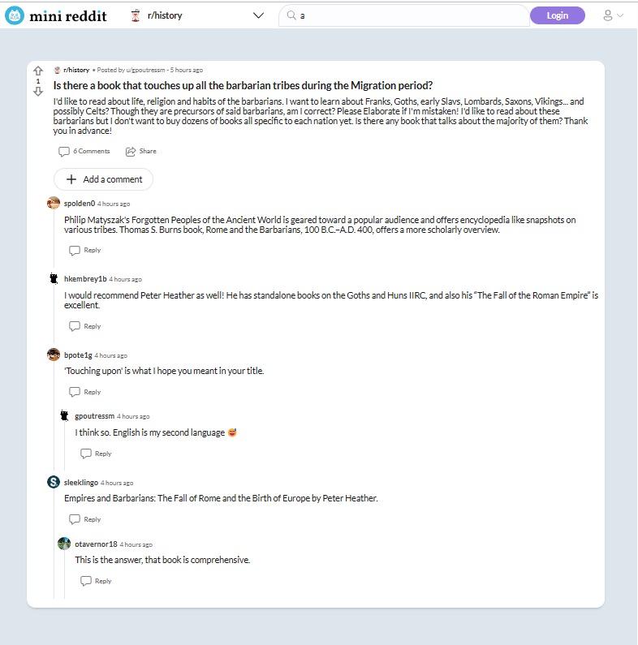
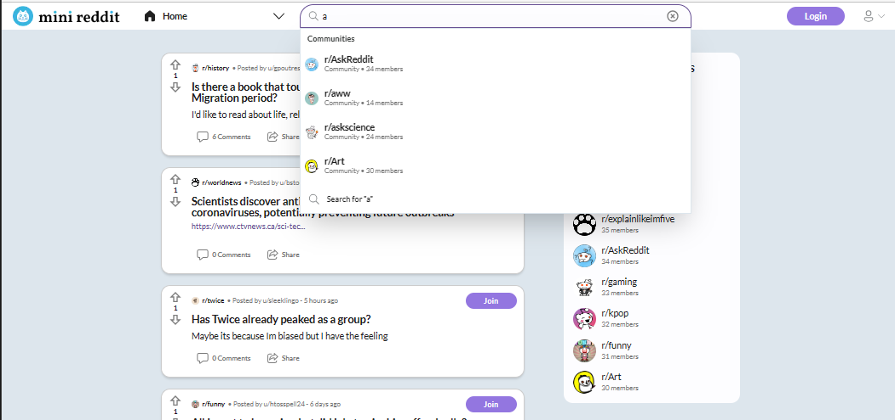

 

  
  <h1 align="center">Mini Reddit</h1>
  

    A small-scale version of Reddit clone
        </a>
  

## Highlighted Features

- Debounced communities search
- Lazy loading for more posts
- Nested and show/hide comments
- Role-based permissions for comments/posts/communities' owners.
- Server-Side Rendering for single post page.

## Built with

- [Next.js](https://nextjs.org/) (React.js framework)
- [Typescript](https://www.typescriptlang.org/) with `strict:true`
- [TailwindCSS](https://tailwindcss.com/)
- [ApolloGraphQL](https://www.apollographql.com//)
- [PostgreSQL](https://www.postgresql.org/)
- [Firebase](https://firebase.google.com/)
- [Nodemailler](https://nodemailer.com/)
- [ExpressJS](https://expressjs.com/)
- [TypeORM](https://typeorm.io/)

## Screenshots

- Main page

- Community page

- User page

- Single post page with comments

- Communities search

- Posts search

